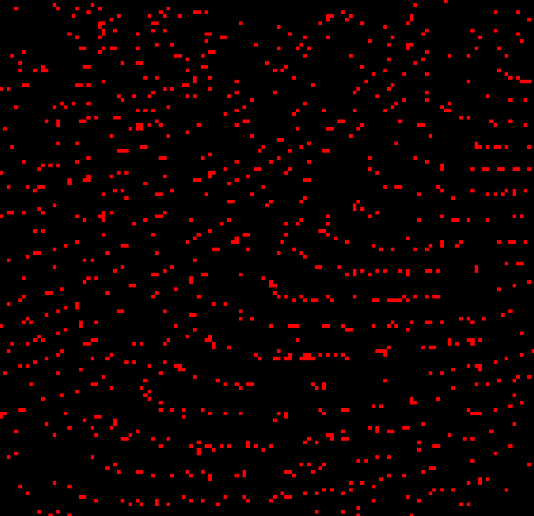

# Spiking_Neural_Network
A spiking neural network (SNN) written in Java

---

## Usage: ##

There are a few parameters that can be given using the following flags, you can use --help to view them all. 


        --neuron-count: The number of neurons in the network.

        --simulation-time: The amount of time in ms the SNN should run.

        --time-step: The size of dt for the LIF equation.

        --input-neurons: Amount of input neurons.

        --output-neurons: Amount of output neurons.

        --inhibitory-neurons: Amount of inhibitory neurons.


Example:
```
java -jar SNN-0.2-alpha.jar --input-neurons=80 --output-neurons=2 -dt=0.1 --neuron-count=8000

```
---

